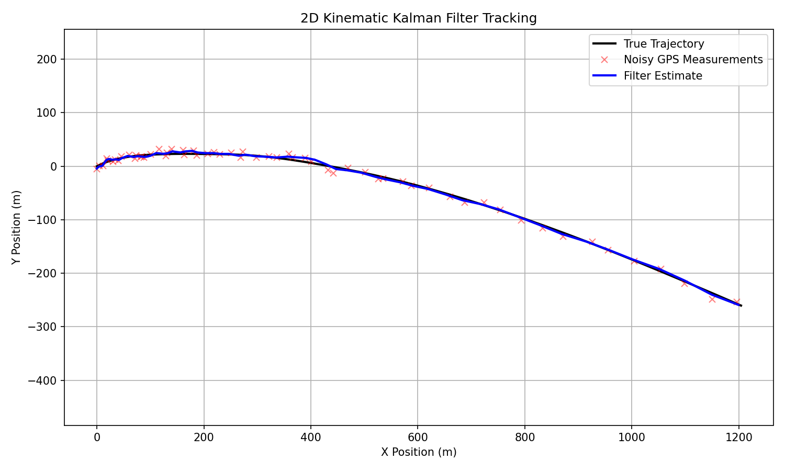
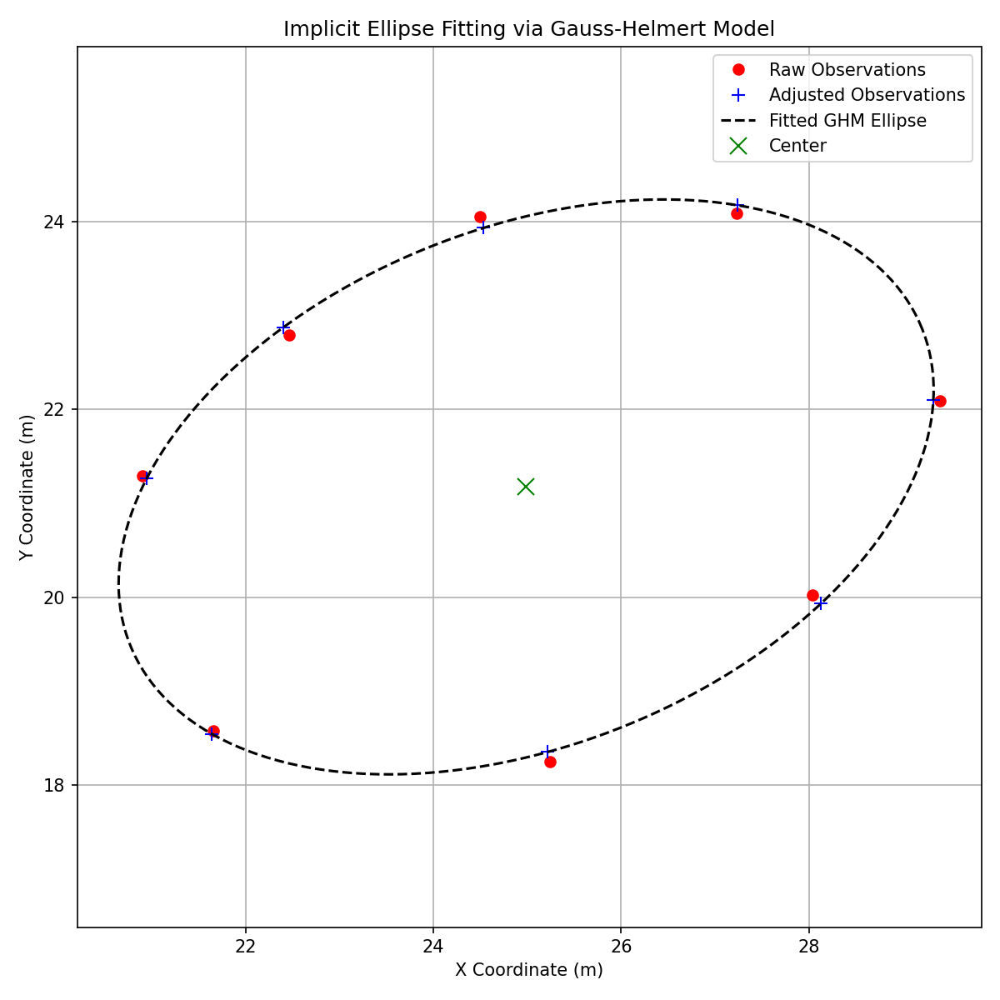

# State-Estimation-Filters-Python

[](https://www.python.org/downloads/)
[](LICENSE)

A generalized, object-oriented Python library for rigorous **State Estimation** and **Sensor Fusion**. It implements core mathematical filters robust enough for professional Navigation Engineering and surveying applications.

## Mathematical Architecture

### 1. Linear Kalman Filter (LKF)
The `LinearKalmanFilter` class estimates the internal state of a linear dynamic system from a series of noisy measurements. It is fundamental in object tracking, navigation loops, and predictive smoothing.

**Prediction (Time Update):**
- $x_k^{-} = \Phi x_{k-1}^{+}$
- $P_k^{-} = \Phi P_{k-1}^{+} \Phi^T + Q$

**Correction (Measurement Update):**
- $\nu_k = z_k - H x_k^{-}$ (Innovation)
- $S_k = H P_k^{-} H^T + R$ (Innovation Covariance)
- $K_k = P_k^{-} H^T S_k^{-1}$ (Kalman Gain)
- $x_k^{+} = x_k^{-} + K_k \nu_k$
- $P_k^{+} = (I - K_k H) P_k^{-} (I - K_k H)^T + K_k R K_k^T$ (Joseph Form)

*Includes a $\chi^2$ statistical innovation test to detect and flag measurement anomalies in real-time.*

### 2. Gauss-Helmert Model (GHM)
The `GaussHelmertEstimator` is a highly robust non-linear Least Squares solver for implicit constraint models where observations cannot be explicitly separated from parameters. 

**Implicit Condition Equation:**
$f(\hat{l}, \hat{x}) = 0$

**Normal Equations Resolution:**
Using the parameter Design Matrix $A = \partial f / \partial x$ and observation Condition Matrix $B = \partial f / \partial l$:
- $Q_{ww} = B Q_{ll} B^T$
- $\Delta x = (A^T Q_{ww}^{-1} A)^{-1} A^T Q_{ww}^{-1} (-w)$

Calculates rigorous aposteriori variance factors ($\hat{\sigma}_0^2$) and precision standard deviations for all parameters.

## Installation

```bash
git clone https://github.com/AmrFawzy-NavEng/State-Estimation-Filters-Python.git
cd State-Estimation-Filters-Python
pip install -r requirements.txt
```

## Application Examples

### Example 1: Kinematic 2D Tracking (Kalman Filter)
Estimates a 6-state vector (Position, Velocity, Acceleration) of a uniformly accelerated platform using noisy GPS fixes.
```bash
python examples/ex01_kinematic_kalman_filter.py
```


### Example 2: Photogrammetric Ellipse Fitting (GHM)
Fits an analytical ellipse strictly adhering to 8 noisy surveying coordinates using the non-linear Gauss-Helmert solver.
```bash
python examples/ex02_ghm_ellipse_fitting.py
```


## License
MIT — see [LICENSE](LICENSE) for details.
